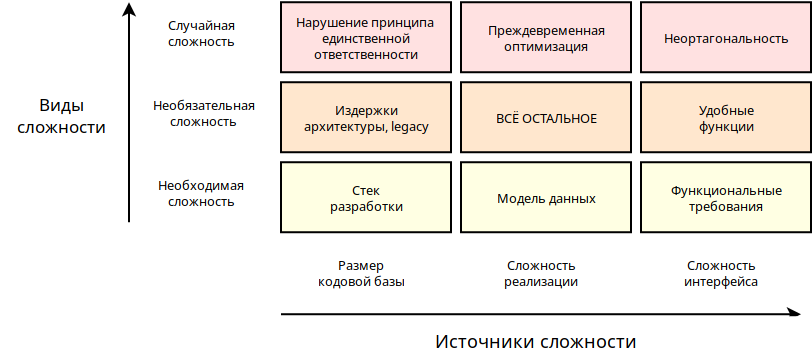
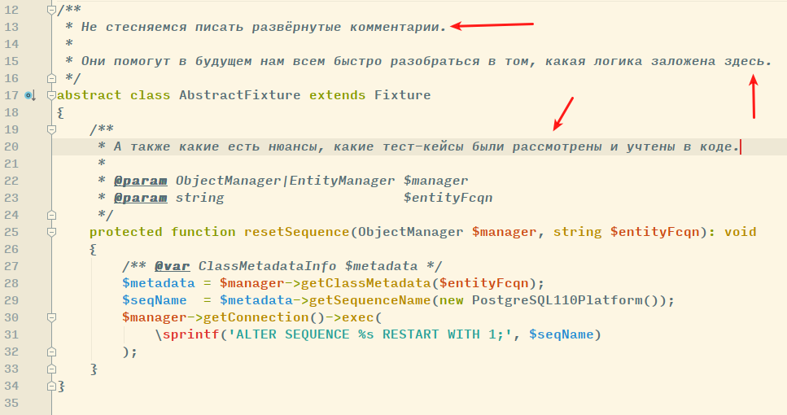

# Coding convention

## 1. Общие правила
1.1. **TDD**

Cначала тест — потом код. Не тестируемый код - легаси код.

1.2. **KISS** 

Делай проще, НЕ надо усложнять на ровном месте.



Ортогональность — этот термин был введен в информатике для обозначения некой разновидности независимости или не связанности. Два или более объекта ортогональны, если изменения, вносимые в один из них, не влияют на любой другой. Похожая семантика: слабая связанность; независимость компонентов.

Все следует делать так просто, как только возможно, но не проще.

1.3. **Меньше кода — меньше проблем**

Не нужно пытаться делать в рамках поставленной задачи смежные задачи. Одна issue — одна задача.

1.4. **Документируй**

подробнее см. п. 17. PHPDoc

1.5. **Баги важнее фич**

Есть ли есть задачи с багами, то они приоритетнее фич-задач с любыми приоритетами.

1.6. **Толерантность**
* Все люди разные, у всех свой жизненный опыт и взгляды, это нормально. Нужно быть терпимым к другим взглядам и чужим мнениям.
* Нужно быть толерантным к чужому коду, даже если кажется, что там все плохо. Всегда (!) найдется более сильный разработчик, который возможно скажет тоже о твоем коде, который ты считаешь идеальным. Хочешь реально помочь проекту и человеку - донеси до него свою точку зрения так, чтобы он понял.

1.7. При написании кода, следует стремиться к прохождению "предупреждений" phpStorm согласно настроенным инспекциям.

1.8. Нельзя дополнять свою ветку изменениями из любых веток кроме develop (чужой код не должен присутствовать в твоих коммитах).

1.9. TODO в коде допустим только в одном случае: если на доработку/исправление требуется много времени, которое выделить не могут, создана задача на доработку. Комментарий с TODO должен быть строго в формате "TODO: vtis-999" без дополнительных объяснений.

### 2. Ветвление
2.1. Стоит учесть, что экстренные правки (фиксы) делаются через hotfix, плановые исправления ошибок делаются через feature (фичи).

2.2. Фичи делаются из ветки `develop` с названием вида: `feature/номерЗадачи_название` (прим: `feature/33_create_database_dropper`).

2.3. Фиксы делаются из ветки `master` с названием вида: `hotfix/номерЗадачи_название` (прим: `hotfix/65_show_teams_in_match`).

2.4. Название создаваемой ветки должно начинаться с номера задачи и краткого описания,  например `108_refactoring_evaluation_system`.

### 3. Коммиты
3.1. В начале коммита должен быть значок # далее номер задачи и текст коммита, например `#123 Исправлено отображение сущности в админке.`

3.2. Следует избегать персонализации (завязка на GUID-ы пользователей, имен в комментариях), комментарии устаревают, люди меняются.

## 4. Проведение code review
4.1. Не нужно все лично воспринимать.

4.2. Ревьюеры не просто указывают на опредленные аспекты написанного кода. Нужно к этому отнестись крайне внимательно, и понять точку зрения ревьюера.

4.3. Конструктивные комментарии коллег порою сильно помогают, позволяют посмотреть на проблему и решение с другой стороны, когда “глаз замыливается” и со стороны бывает виднее.

4.4. Нужно помнить, что у нас единая цель — сделать легко поддерживаемый, отказоустойчивый и масштабируемый код. Путем конструктивных переговоров и обмена опытом — сделать это сильно проще. Командная работа дает очень хороший синергетический эффект.

## 5. Завершение задачи
5.1. Завершил задачу — запусти все тесты локально на своей ветке

5.2. После успешного прохождения всех тестов на своей ветке, вмерджи в свою ветку develop, и еще раз запусти все тесты.

5.3. Когда все тесты зашли — запушь задачу и создай pull request.

5.4. Напиши **чеклист**
* см. п. [Чеклист](# 6. Чеклист)
* (отчасти он основан на [гугловской статье](https://testing.googleblog.com/2017/06/code-health-too-many-comments-on-your.html))

## 6. Чеклист
### 6.1. Пункты чеклиста
* **Сделал**: Мне понятен каждый пункт условия задачи, и для каждого пункта есть конкретные строки в коде, которые его реализуют.
* **Исправил**: (*Если задача вернулась и вы ее доработали*). Мне понятны все комментарии в ревью, и я знаю почему они написаны. Я с ними согласен или высказал свои возражения. Я исправил код, теперь такие комментарии к моему коду неприменимы.
* **Протестировал**: Я протестировал эту задачу непосредственно перед передачей на ревью: запустил тесты/открывал страницу/жал на кнопку.
* **Прочитал**: Я перечитал diff в MR на GitHub/GitLab. Я не вижу простых способов существенно его улучшить, он понятный, и (для больших задач) я не вижу способа его сократить. Если diff целиком непонятен, то он разбит на атомарные коммиты.

### 6.2. Пояснения по пунктам
* **Исправил**: применимо ко второму и далее ревью. Читать diff нужно именно в MR на GitHub/GitLab, **не стоит использовать для этого IDE, в которой вы обычно работаете**.
* **Прочитал**, не вижу способа его сократить: условие особенно важно для больших задач, и в том числе предполагает, что в коде **отсутствует рефакторинг**.
* **Исключения**: задача явно требует рефакторинга, или же рефакторинг небольшой и не может изменить логику работы.

### 6.3. Примечания
* Чеклист обязателен, при передаче задачи на код ревью в GitHub/GitLab должен быть комментарий формата "Чеклист: сделал, исправил, проверил, прочитал" или "Чеклист: сделал, проверил, прочитал"
* Если вы что-то из этого пропустили, так и напишите, особенно если на то есть причина - "не проверил, потому что требует доступа к prod".
* Пожалуйста, отнеситесь к ответу на чеклист ответственно - например, не пишите "проверил" в коде, который вы не запускали, и не пишите "исправил", если половину комментариев вы не поняли.

### 6.4. Пример
*Обязательный чеклист в первом комментарии pull-request*

Чеклист к задаче #42:
1. **Сделал**: исправлен баг с тем-то тем-то
2. **Протестировал**: на таком-то юнит-тесте / на такой-то странице / в таком-то блоке
3. **Прочитал**: дифф понятен, не вижу способа сократить

## 7. Именование идентификаторов

### 7.1. Переменные, свойства класса, функции, методы класса (camelCase)

`$isOptions`

`$isWmsStore`

`function getOptions()`

### 7.2. Ключи в ассоциативных массивах

Можно писать хоть на китайском 如你所愿, главное чтоб было уместно и понятно

`[ 'тра ла лэйло' => 'something']`

`['guid' => '']`

`['is_active' => '']`

### 7.3. константы (SCREAMING_SNAKE_CASE)
`const WMS_API_USER = 1;`

### 7.4. Примечание
Сокращения (vtis, WMS, GUID) при именовании переменных рассматриваются единым словом. 

Пример: $isWms, function getGuid(), ['vtis_nomenclature_guid' => ...]

## 8. Правила подбора имен
8.1. Названия идентификаторов должны быть литературными английскими словами (транслит не допустим).

8.2. Названия идентификаторов должны четко отображать действительное назначение переменной, функции и ни в коем случае не вводить в заблуждение.

8.3. Название не булевых переменных должно отвечать на вопрос: что? кто? ($user, $distributionCenter)

8.4. Название не булевых функций должно начинаться с глагола: (getStoresForReserve, prepareFilter ...) При этом функции, которые имеют возвращаемое значение, должны начинаться с get.

8.5. Название переменных(функций), хранящих(возвращающих) булево значение, должно именоваться вопросительным предложением ($isWmsAvailable, $canUserChangePrice)

8.6. В названиях переменных недопустимо использовать не общепринятые сокращения, которые не представлены в словаре. Внесение новых сокращений в словарь возможно.

8.7. Именование идентификаторов не должно быть слишком коротким или слишком длинным. Именование идентификаторов должно быть необходимым и достаточным для понимания сути его использования.

8.8. ДОПУСТИМО использование в названии идентификаторов окончания Dto.

8.9. ВОЗМОЖНО использование в названии идентификаторов окончания Data, только если без него искажается представление о содержимом переменной.

## 9. Контроллеры
9.1. Придерживаемся Invokable Controllers (Single Action Controllers).

9.2. A controller is a PHP function you create that reads information from the Request object and creates and returns a Response object.

9.3. Недопустимо размещение бизнес-логики приложения в контроллере за исключением валидации входящих данных.

## 10. Сервисы
10.1. Наименование класса сервиса - существительное в единственном числе, либо существительное в единственном числе с определениями и дополнениями.

Из наименования класса сервиса должно быть очевидно, что делает данный сервис. 

Например: Logger, AvailabilityCalculator, ReserveExpiringLetterCreator

10.2. Не прописываем в конфигурационном файле аргументы, передаваемые в конструктор сервиса, используем вместо этого параметр autowire: true

10.3 Сервисам, которые создаём или правим, дописываем в конфигурационном файле параметр public

## 11. Именование таблиц, столбцов в БД
11.1. Для именования таблиц и столбцов используется under_score.

11.2. Именование таблиц всегда выполняется с помощью существительного в единственном числе, описывая одну запись в таблице.

11.3. Поля свойств объекта не должны содержать повторения названия объекта.

11.4. Поля, ссылающиеся на другие объекты, должны именоваться название_связанной_таблицы_поле_связанной_таблицы и иметь объявленный FOREIGN KEY

11.5. ON DELETE и ON UPDATE не используем, логика для очевидности должна быть только в коде

## 12. Именование индексов БД
Все индексы ДОЛЖНЫ иметь префикс типа:
* UNQ_ - unique
* IDX_ - index
* FT_ - full text
* FK_ - foreign key

После префикса перечисление полей, в порядке, объявленном в индексе с разделителем _

Пример: UNQ_user_append_date

## 13. Doctrine
13.1. НЕДОПУСТИМО использование методов репозитория find(), findBy(), findOneBy(), findAll() вне репозитория.

13.2. НЕДОПУСТИМО использование метода репозитория findAll() без параметров.

13.3. Методы, начинающиеся на глагол GET, должны возвращать значение (не null) или бросать исключение, если не может возвратить значение. (При использовании не нужно проверять на null и создавать эксепшн в коде приложения)

13.4. Методы, начинающиеся на глагол FIND, должны возвращать значение если оно есть или null, если значение не было найдено.

(Если используем, значит у нас есть какия-то логика связанная с тем что обьекта в репозитории нет)

(Ссылка бестпрактис по Доктрине. Слайды: https://ocramius.github.io/doctrine-best-practices/#/94)

13.5. Порядок цепочки вызовов

В queryBuilder построение цепочки вызовов НЕОБХОДИМО начинать с select, следом все join.

13.6. where VS andWhere

В QueryBuilder для избежания нелепых ошибок, опечаток и мержей для добавления where НЕОБХОДИМО использовать andWhere

13.7. Алиасы таблиц.
* В качестве алиаса используем полное наименование сущности в camelCase при использовании гидраторов, например `orderCommodity`.
* В остальных случаях используем алиасы из первых букв сущности, например `oc`.

## 14. Создание новой сущности
* Указывать комментарий в phpDoc к классу Entity, описывающий суть (сопоставление с бизнес сущностью, какой-то предметной областью).
  Пример: Склад, Контрагент, Касса.
* Необходимо сразу создавать все геттеры и сеттеры сущности
* Необходимо сразу создавать класс репозитория, даже если он пустой

## 15. Фикстуры
### 15.1. Назначение фикстур
**Main**-фикстуры - постоянно присутствующие в тестовой БД данные\
**Runtime**-фикстуры - загружаются в БД на время выполнения теста и должны быть удалены после его выполнения.

#### Main-фикстуры являются приоритетными при выборе типа фикстуры. Используется в следующих случаях:
* Когда там нет ни одной фикстуры по текущей сущности, что также подразумевает их повторное использование
* Когда это единичные данные и не влияют сильно на общую структуру данных в тестовой БД
* Когда есть вероятность повторного использования этих данных по сущности в других тестах
* Когда такие данные нужно использовать в админке либо при тестировании в postman или из браузера
* Когда такие данные необходимы для обеспечения работы элементов приложения, важных для разработки или работы админки
* Main фикстуры не должны иметь много данных. Если там уже много данных по конкретной сущности, 
  то выбор идет в пользу создания Runtime фикстуры

#### Runtime-фикстуры является вспомогательными и используется в следующих случаях:
* Когда по этой сущности уже есть Main фикстуры в достаточном количестве и по разным причинам 
  не удобно использовать существующие данные из Main фикстур
* Данные фикстуры будут в тесте добавляться / изменяться / удаляться.
* Данные специфичны для конкретного теста/тестов и не могут быть повторно использованы в других тестах
* Требуется для конкретного теста большое количество данных, которые можно сгенерировать динамически
* Требуется изолировать фикстуру, чтобы данные не влияли на другие тесты кроме требуемого
* Прочие обстоятельства, делающие создание фикстуры во время выполнения теста более предпочтительным
  Пример такой ситуации: дата в фикстуре должна быть всегда на день больше текущей.

### 15.2. Размещение фикстур
Main-фикстуры привязаны к сущностям, а не к локации классов тестов, потому все лежат в одной папке Main
Runtime-фикстуры, размещаются в индивидуальных подкаталогах, соответствующих тесту или группе тестов для котрых они предназначены

Про особенности использования фикстур читайте тут [doc/app/Articles/UsingFixtures.md](doc/app/Articles/UsingFixtures.md)

**Пример:**  
Для класса теста:  
`App\Tests\ApiAction\Component\Resume\ResumeConstructorActionTest`  
Runtime-фикстуры фикстуры должны лежать в каталоге:  
src/Doctrine/Fixture/Runtime/**ApiAction/Component/Resume/ResumeConstructorActionTest**  
Размещать фикстуры вне каталога конкретного теста допустимо в том случае, если она используется одновременно
несколькими тестами из дочерних каталогов.

## 16. Рефакторинг
16.1. Только в рамках отдельной задачи. Непрерывно рефакторить нужно, но это не входит в фич-задачу — нужно создать  обсуждение на тему рефакторинга.

16.2. При переработке функционала недопустимо оставлять закомментированный или никогда не используемый код. Такой код устаревает и путает при дальнейшей работе над функционалом.

## 17. PHPDoc
* Не стесняйся писать побольше слов в phpDoc. Вспомни как писал сочинения на уроках про то, как ты провел лето. 
  Здесь тоже самое только про написанный код. Пиши так, чтобы сам через продолжительное время мог быстро разобраться в нюансах своей реализации.
  
* При наследовании от интерфейса или переопределении метода — стоит использовать @inheritdoc, и его уже дополнить своими комментариями.
* Необходимо обязательно заполнять PHPDoc, с указанием параметров, возвращаемых значений, а также выбрасываемых исключений и их типов.
* Блок PHPDoc писать до объявления блока кода к которому он относится. 
* В PHPDoc тип переменной писать до ее названия, порядок сортировки блоков (param, return, annotation) важен: должен быть последователен, логичен. 
  При сомнениях в сортировке проверяется автоматической сортировкой phpStorm
* Все типы переменных должны быть максимально определены, с помощью php объявлений и аннотаций.
* Пишем однострочные phpDocs при аннотации типов переменных в коде
`/** @var type */`
  вместо
  ```
  /**
  * @var type
  */
  ```

* При описании массивов указываем в явном виде тип содержимого, т.е. вместо array явно указываем string[], Order[], ,mixed[], array[] и т.д.

