# Настройки PhpStorm

## 1. Code-Style
Файл `CodeStyle_mic_v{x}.xml`, где {x} - это актуальный номер версии

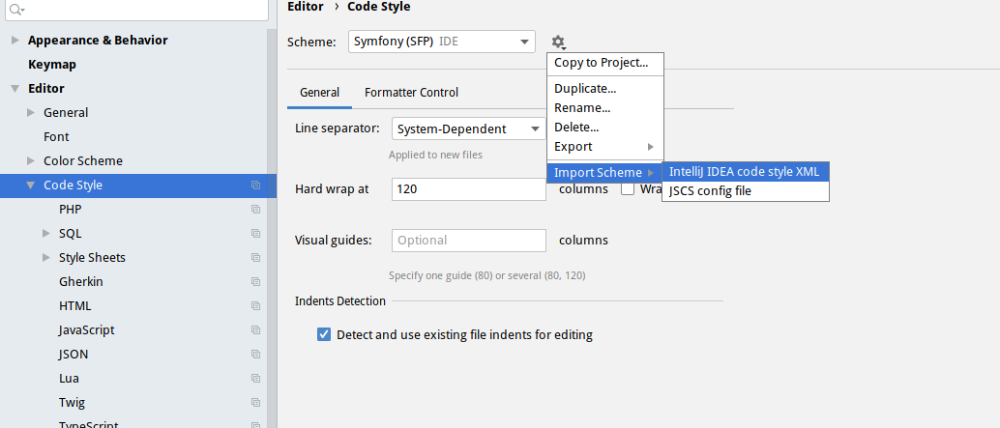

## 2. Inspections
1. Файл `Inspections_mic_v{x}.xml`, где {x} - это актуальный номер версии

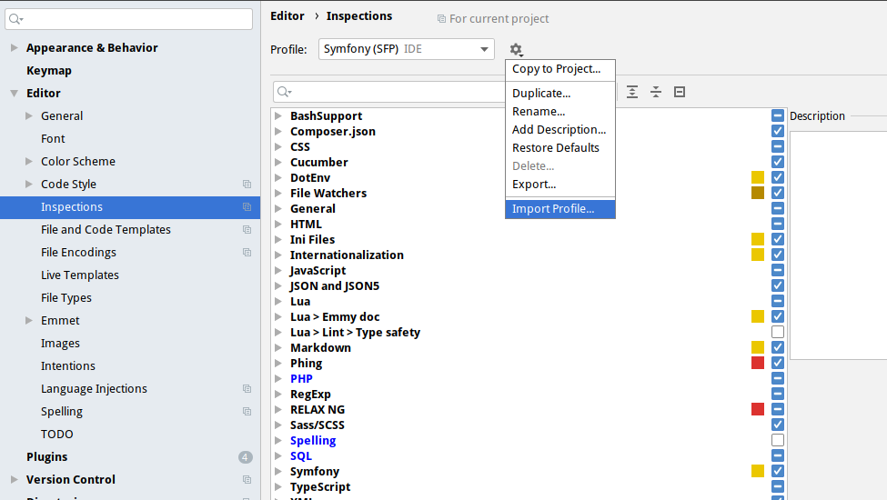

## 3. Установить плагины
- [Symfony Support](https://plugins.jetbrains.com/plugin/7219-symfony-support/)
- [Php Inspections](https://plugins.jetbrains.com/plugin/7622-php-inspections-ea-extended-)

## 4. Настройка xdebug PHP
### 4.1. Для связки Linux + Docker + PhpStorm
- Заходим в php контейнер: `docker exec -it dev_myitcareer_app bash`
- Определяем IP хоста: `ip route | grep default | awk '{print $3}'`
- Полученный IP указываем в `.env` файле, параметр `DOCKER_HOST_IP`
- в .env `XDEBUG_CONFIG=remote_host=ip` ip нужно изменить на полученный в предыдущем пункте ip адрес и пересобрать контейнеры
- - Пересобираем образы и применяем настройки: `docker-compose -f docker-compose.yml -f docker-compose.override.dev.yml up -d --build`

### 4.2. Настройка PHPStorm
- настраиваем PHP language level `PHP`  
  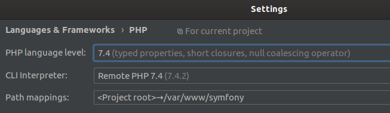
- добавляем cli интерпретатор (Host: `localhost`, username: `www-data`, password: `myitcareerdev`, port: `40085`)  
  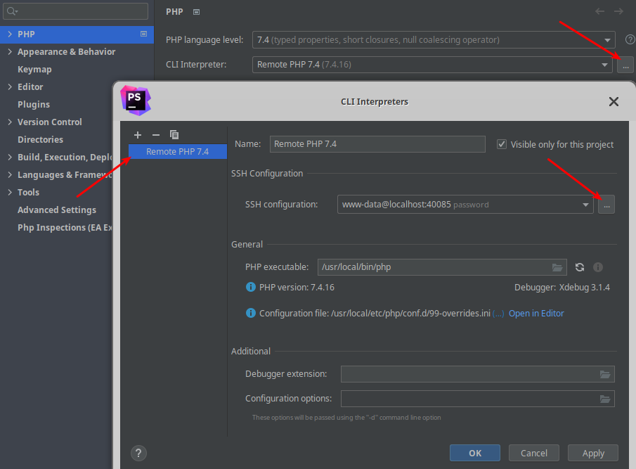  
  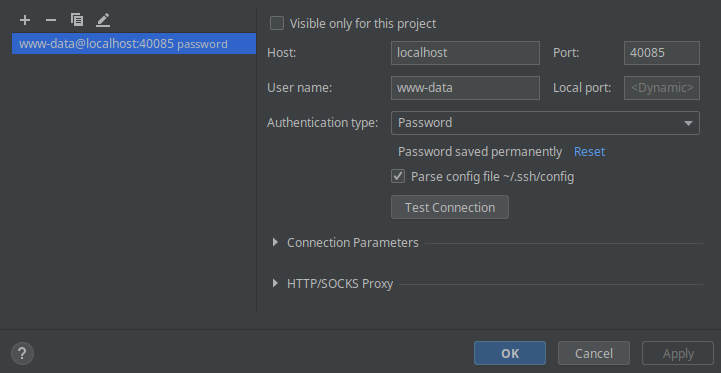
- добавляем Path mappings  
  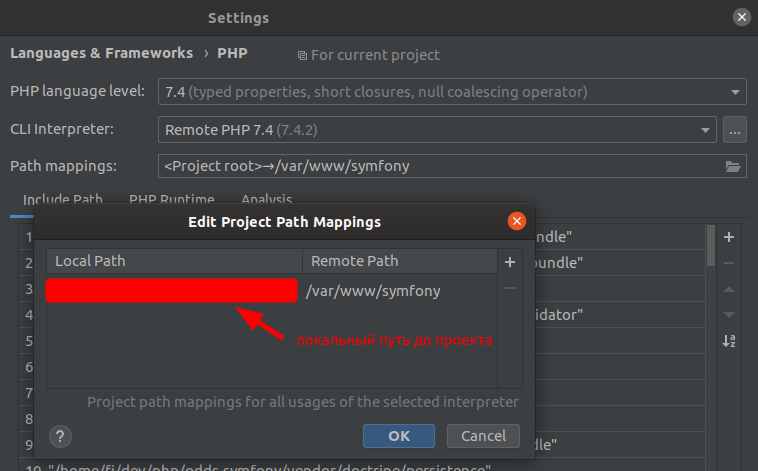
- добавляем порты 9000, 9003, 9009 в xdebug `PHP | Debug`  
  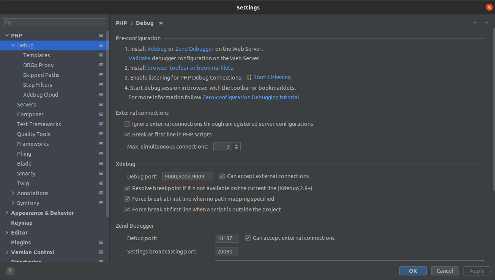
- добавляем сервер `PHP | Servers`  
  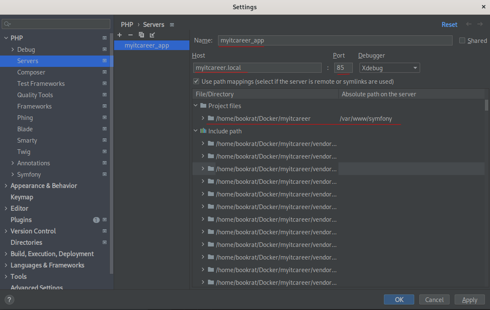 

## 5. Настройка phpUnit
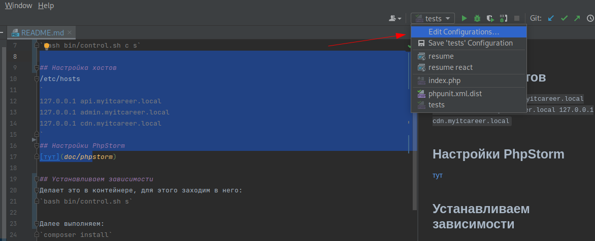

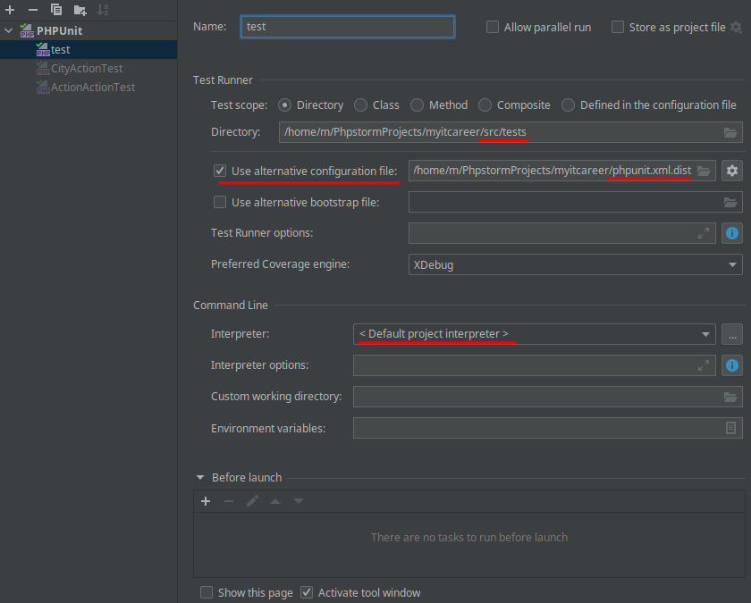

## 6. Проверка работоспособности xdebug & unit tests
- Перейти к файлу src/tests/ApiAction/Entity/CityActionTest.php
- Поставить брейкпойнт (см. скрин)
- Нажать правой кнопкой мыши на нем
- Выбрать пункт Debug 'CityActionTest (PHPUnit)', запустим тем самым тест в режиме xdebug
- Должно появиться нижнее окно (см. скрин)

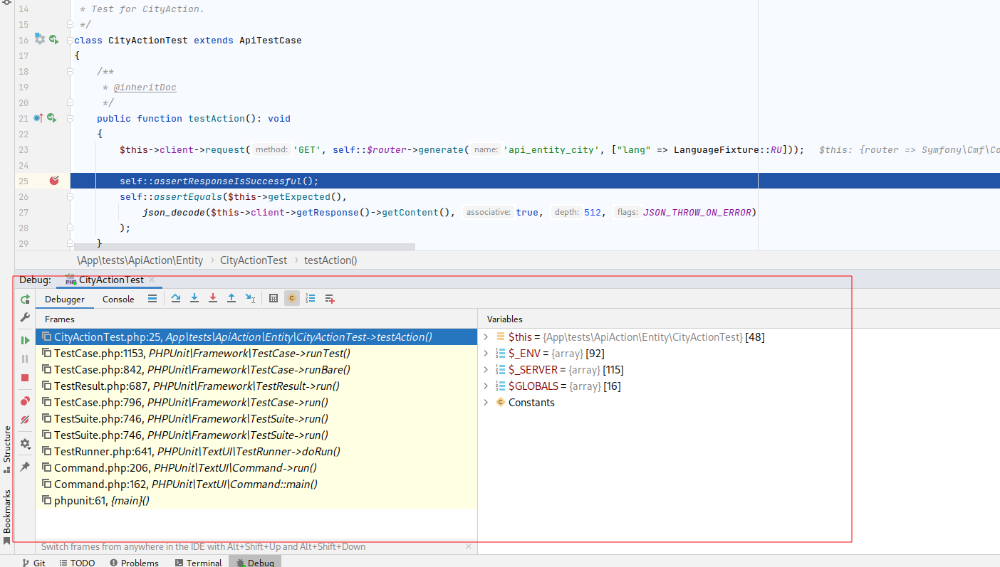

## 7. Открытие файлов из веб-профайлера в PhpStorm
https://github.com/aik099/PhpStormProtocol
