# Настройки VS Code

Подразумевается, что на момент настройки, репозиторий с проектом уже склонирован на ПК.  
Если говорится сделать что либо `на хосте`, значит нужно сделать это в вашей ОС а не в докер-контейнере.

## 1. Настройка юнит-тестов с возможностью отладки (Linux + Docker)
### 1.1.1 Настройка подключения к контейнеру по SSH
- Установить в `.env` переменную `IDE` в значение `vscode`.
- Выполнить **на хосте**:
    ```shell
    mkdir -p "${HOME}/.vscode_data_for_mic/.vscode-server"
    touch "${HOME}/.vscode_data_for_mic/authorized_keys"
    ```
- Проверить существует ли на хосте в домашнем каталоге файл `.gitconfig`. Если нет, то создать.
- Если контейнеры запущены - перезапустить их, если не запущены - запустить.
- Установить расширение [Remote - SSH](https://marketplace.visualstudio.com/items?itemName=ms-vscode-remote.remote-ssh)
- Открыть Remote Explorer  
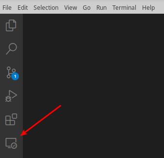
- Нажать на "+" в его панели и ввести команду подключения в появившееся вверху поле для ввода:
    ```shell
    ssh www-data@localhost -p 40085
    ```
- Выбрать файл, в который будет сохранено это соединение.
- В списке соединений появится новое с названием `localhost`. Запустить его при помощи контекстного меню или кнопки справа.  
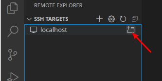
- Ввести пароль для SSH: `myitcareerdev`.
- Открыть Explorer.  
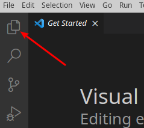
- Нажать `Open Folder` и выбрать каталог `/var/www/symfony/`.
- Снова ввести пароль для SSH. В панели Explorer'а должно отобразиться содержимое каталога проекта.
- Закрыть все экземпляры VS Code и снова открыть его. Теперь у соединения должна появиться вложенная опция c путём к каталогу проекта:  
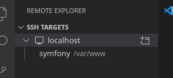  
Подключаться теперь следует через неё, так будет сразу открываться каталог проекта. Также можно пользоваться меню `Open Recent`.  
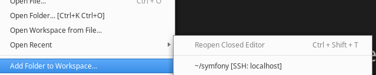  

### 1.1.2 Обеспечение автоматического подключения VS Code без ввода пароля.
**Внимание** Перечисленные в этом разделе действия выполняются **на хосте** а не в контейнере.
- Выполнить:
    ```shell
    ssh-keygen
    ```
- Ввести путь к файлу в который будет сохранён ключ:
    ```shell
    /home/имя_вашего_пользователя/.ssh/key_for_mic_app_cont_ssh
    ```
- Придумать и ввести какой-либо надёжный пароль (запомнить его, он пригодиться позже).
- Подтвердить пароль.
- Убедиться, что в указанном выше каталоге есть сгенерированные файлы:
    * `key_for_mic_app_cont_ssh` (файл закрытого ключа),
    * `key_for_mic_app_cont_ssh.pub` (файл открытого ключа).
- Выполнить:
    ```shell
    ssh-copy-id -i ~/.ssh/key_for_mic_app_cont_ssh.pub www-data@localhost -p 40085
    ```
    Ввести пароль от контейнера (тот что вводился в при настройке подключения а не при генерации ключей).  
    Если всё прошло успешно вы увидите:
    ```shell
    Number of key(s) added: 1

    Now try logging into the machine, with:   "ssh -p '40085' 'www-data@localhost'"
    and check to make sure that only the key(s) you wanted were added.
    ```
- Закройте VS Code и откройте снова. На этот раз пароль от подключения запросит не VS Code, а операционная система. Нужно ввести тот пароль, который вы придумали на этапе генерации ключей.
- Поставьте галочку для автоматического входа под полем для ввода пароля иначе после каждой перезагрузки пароль придётся вводить заново.

_Плагины которые были установлены ранее (до подключения по SSH) не будут доступны. Если они нужны их придётся установить и настроить повторно. Верно и обратное - плагины установленные в экземпляре VS Code, подключенном по SSH к docker-контейнеру, не будут доступны экземплярам, не подключенным к этому контейнеру. Это же может касаться и некоторых настроек VS Code и используемых настроек сторонних пакетов, вроде имени и eMail, указываемых при настройке git._

В дальнейшем все действия осуществляются в экземпляре VS Code, подключенном к контейнеру через SSH. Команды, выполненные в терминале этого экземпляра VS Code, будут выполнены в подключенном контейнере. Когда говорится "выполнить в контейнере" без уточнения его имени, подразумевается контейнер к которому подключен VS Code, то есть `dev_myitcareer_app`.

### 1.2 Обеспечение коммуникации с Xdebug
- Установить расширение [PHP Debug](https://marketplace.visualstudio.com/items?itemName=xdebug.php-debug) от `Xdebug`.
- Открыть панель запуска и отладки.  
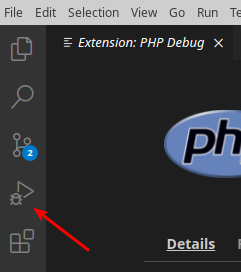
- На панели нажать `create a launch.json file` и выбрать окружение `PHP`
- Добавить `/.vscode` в `.gitignore`.
- В открывшемся `launch.json` удалить порт для секции с `"name": "Listen for Xdebug"`. Результирующие настройки этой секции должны выглядеть так:
    ```json
        {
            "name": "Listen for Xdebug",
            "type": "php",
            "request": "launch",
        },
    ```
### 1.3 Обеспечение запуска юнит-тестов
- Отредактировать в файле `phpunit.xml.dist` тег `directory` внутри `testsuites` следующим образом: 
    ```xml
    <testsuites>
        <testsuite name="Project Test Suite">
            <directory>src/tests</directory>
        </testsuite>
    </testsuites>
    ```
    _Изменение этого тега не влияет на работоспособность юнит-тестов и их отладки в PhpStorm_
- Установить расширение [PHPUnit Test Explorer](https://marketplace.visualstudio.com/items?itemName=recca0120.vscode-phpunit).
- Зайти в настройки этого расширения (Шестерёнка справа от имени расширения -> Extension Settings) и указать в опции `Phpunit: Files` следующее значение:
    ```
    src/**/*Test.php
    ```
- Перезапустить VS Code.

### 1.4 Проверка запуска юнит-тестов
- Открыть панель тестирования.  
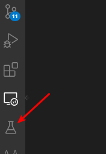  
Если всё настроено верно то в ней должны отобразиться все тесты из каталога `src/tests`.
- Выбрать тест `App/tests/ApiAction/Entity/CityActionTest.php` и нажать кнопку с треугольником справа от названия.
- Если тест выполнен успешно он должен выглядеть следующим образом:  
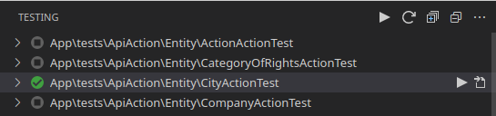
- Запустить все тесты  
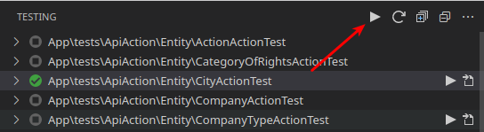  
Все должны выполнится успешно. Если есть проваленные тесты то можно попробовать выполнить следующие действия (все сразу или по отдельности):
    * выполнить в контейнере `composer install`;
    * очистить кэш;
    * загрузить фикстуры.
После этого снова попробовать запустить тесты.

### 1.5 Проверка отладки юнит-тестов
- Выбрать тест `App/tests/ApiAction/Entity/CityActionTest.php` и нажать `Show source` кнопку справа от кнопки его запуска.
- Установить точку останова как на изображении:  
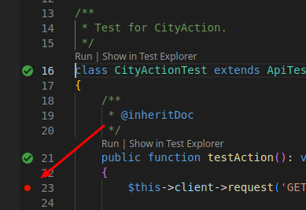
- Запустить прослушивание Xdebug на F5. В верхней части окна должна появиться панель управления отладкой.  
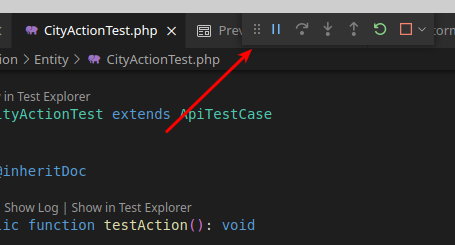
- Запустить тест.
- Если всё настроено верно то область редактора будет выглядеть так:  
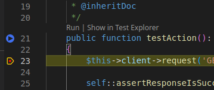  
Возможно причиной проблем может быть выбор неподходящего режима запуска. Перейдите на панель `Run and Debug` и вверху справа от треугольника выберите `Listen for Xdebug`.

### 1.6 Дополнительные настройки юнит-тестов
_Эти настройки не обязательны_
#### 1.6.1 Добавить пункты контекстного меню редактора для запуска тестов
В настройках расширения `Test Explorer UI` включить `Test Explorer: Add To Editor Context Menu`. Эти пункты меню не будут работать с в нативном интерфейсе тестирования (см. 1.6.2).

#### 1.6.2 Альтернативный интерфейс
Существует 2 интерфейса работы с тестами - обычный и нативный. Они переключаются в настройках расширения `Test Explorer UI` опцией `Test Explorer: Use Native Testing`. Нативный более информативен и нагляден при работе с отдельным тестом, однако возможно он ещё немного сыроват, например он не позволяет выполнить все доступные на панели тесты сразу, а так же не запускаются тесты из контекстного меню в редакторе. Обычный, (обеспечиваемый расширением Test Explorer UI) считается устаревшим, но позволяет запустить все тесты.

### 1.7 Известные проблемы с юнит-тестами
- При некоторых ошибках в юнит-тестах, которые не связаны с проверкой входных данных случается краш сервера плагина. В этом случае на вкладке `Output` для `PHPUnit Language Server` последним сообщением будет подобное: 
    ```
    [Info  - 11:27:58] Connection to server got closed. Server will restart.
    ```
    В этом случае нужно перезапустить VS Code. Если не помогло, попробовать очистить кеш проекта и/или загрузить фикстуры. Если не помогло и это, такая проблема может означать ошибку в исходном коде, например неверное указание неймспейса в респондере. Выхлоп PHPUnit Language ServerPHPUnit Language Server в таком случае не информативен. Лучше попытаться выполнить этот тест в терминале VS Code командой 
    ```shell
    vendor/bin/phpunit <отн_или_абс/путь_к_тесту>
    ```
    либо выполнить все тесты командой
    ```shell
    vendor/bin/phpunit
    ```
    После фикса ошибки и успешного выполнения теста в терминале нужно перезапустить VS Code, чтобы панель тестов снова заработала.

## 2 Git
### 2.1 Подключение к GitLab-репозиторию проекта
- Установить расширение [GitLab Workflow](https://marketplace.visualstudio.com/items?itemName=GitLab.gitlab-workflow).
- Открыть его панель.  
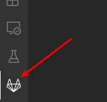
- Следуйте инструкции по авторизации, показанной на панели. В данном случае варианту `Users on Self-managed instances...`  
Если всё будет сделано верно, на панели станут доступны назначенные вам issues и прочие аспекты проекта, синхронизированные с удалённым репозиторием. Панель примет следующий вид:  
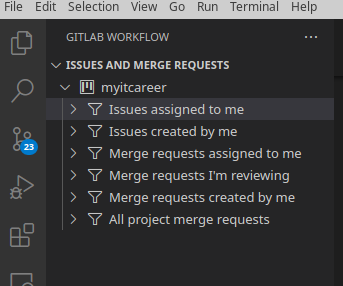

### 2.2 Git
- Скопировать последнюю версию хуков git (Пункт 14.1 основного [README](/README.md)).
- Зайти в настройки, найти `Git: Commands To Log` и добавить туда `push`.
- Проверьте заданы ли переменные `user.name` и `user.email` в настройках git. Для этого `в контейнере` выполните:
    ``` shell
        git config --list --show-origin
    ```
    и поищите их в списке. Для прокрутки списка вниз жмите enter.
- Если переменных нет, или они не соответствуют тем, что в GitLab проекта, задайте их:
    ```shell
        git config --global user.name "Ваше_имя_в_GitLab_репозитории_проекта"
        git config --global user.email Ваш_eMail_в_GitLab_репозитории_проекта
    ```
- Для визуализации графа системы контроля версий установите расширение [Git Graph](https://marketplace.visualstudio.com/items?itemName=mhutchie.git-graph).  
    Чтобы вызвать его нажмите кнопку Git Graph на нижней панели или кнопку на панели Source Control:  
    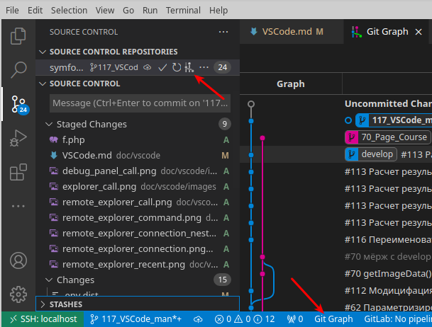
- Для удобного откладывания изменений (stash) установите расширение [Git Stash](https://marketplace.visualstudio.com/items?itemName=arturock.gitstash)  
    После этого должна появиться возможность выполнить stash только для выбранных файлов (через конт. меню в Source Control) и меню `STASHES`:  
    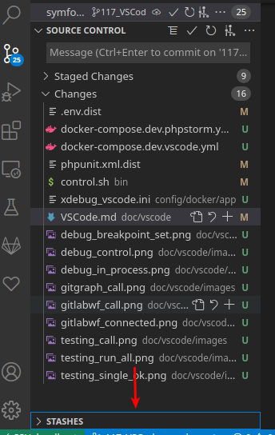

### 2.3 Известные проблемы с Git
- Если при мёрже или коммите будет получено подобное сообщение:  
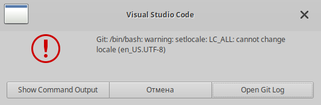  
Нужно нажать на `Show Command Output` чтобы увидеть причины проблемы. Скорее всего сработал гит-хук из-за неверного формата сообщения в коммите.
- Если похожее сообщение было получено при пуше, нажмите Open Git Log. Скорее всего сработал гит-хук из-за ошибки в одном из тестов. В этом случае в Логе Git будут сообщения от Xdebug. Убедитесь, что все тесты проходят успешно и попробуйте ещё раз.

## 3 Поддержка PHP и Symfony
 Будут полезны следующие плагины:
- [PHP Intelephense](https://marketplace.visualstudio.com/items?itemName=bmewburn.vscode-intelephense-client) - всплывающие окна с информацией об объектах, быстрый переход к их реализации, поиск ссылок на них, проверка на ошибки, форматирование и т.д.  
Настройки:
    * `Intelephense › Environment: PHP Version` - указать версию PHP, установленного в контейнере `dev_myitcareer_app` в виде: `7.4.16`. Информация о версии - `php --version` в терминале VS Code.
    * `Intelephense › Files: Exclude` - удалить строку `**/vendor/**/vendor/**`
- [PHP DocBlocker](https://marketplace.visualstudio.com/items?itemName=neilbrayfield.php-docblocker) - генератор PHPDoc'ов. Чтобы сгенерировать введите `/**`.
- [PHP Namespace Resolver](https://marketplace.visualstudio.com/items?itemName=MehediDracula.php-namespace-resolver) - добавит в контекстное меню полезные опции вроде `Import Class`.  
Настройки: `Namespace Resolver: Sort Alphabetically` = вкл.
- [PhpStorm Parameter Hints in VScode](https://marketplace.visualstudio.com/items?itemName=MrChetan.phpstorm-parameter-hints-in-vscode) - добавит подсказки с типом для параметров вызываемых функций.
- [PHP 8 Getter & Setter](https://marketplace.visualstudio.com/items?itemName=MykhailoKushnir.vscode-php-getter-setter)
- [Symfony for VSCode](https://marketplace.visualstudio.com/items?itemName=TheNouillet.symfony-vscode)
Настройки: `Symfony-vscode: PHP Executable Path` = `/usr/local/bin/php`

## 4 Просмотр БД
- Установить расширение [SQLTools](https://marketplace.visualstudio.com/items?itemName=mtxr.sqltools).
- Установить расширение [SQLTools MySQL/MariaDB](https://marketplace.visualstudio.com/items?itemName=mtxr.sqltools-driver-mysql).
- Открыть панель SQLTools по кнопке с цилиндром на сайдбаре, навести курсор на заголовок меню `CONNECTIONS` и нажать `Add New Connection`.
- Выбрать из списка драйвер БД `MySql`.
- Заполнить поля:  
    * `Connection name*`    = любое имя соединения
    * `Connect using*`      = Server and Port
    * `Server Address*`     = db
    * `Port*`               = 3306
    * `Database*`           = myitcareer_dev (подойдёт любое имя существующей БД из контейнера dev_myitcareer_percona)
    * `Username*`           = root
    * `Use password`        = Save password
    * `Password*`           = скопировать из .env - MYSQL_ROOT_PASSWORD
- Нажать `SAVE CONNECTION`, `CONNECT NOW`.

## 5 Полезные расширения
- [DotENV](https://marketplace.visualstudio.com/items?itemName=mikestead.dotenv) - подсветка синтаксиса в .env-файлах.
- [YAML](https://marketplace.visualstudio.com/items?itemName=redhat.vscode-yaml).
- [Diff Tool](https://marketplace.visualstudio.com/items?itemName=jinsihou.diff-tool) - сравнение открытых файлов.
- [Partial Diff](https://marketplace.visualstudio.com/items?itemName=ryu1kn.partial-diff) - сравнение фрагментов.